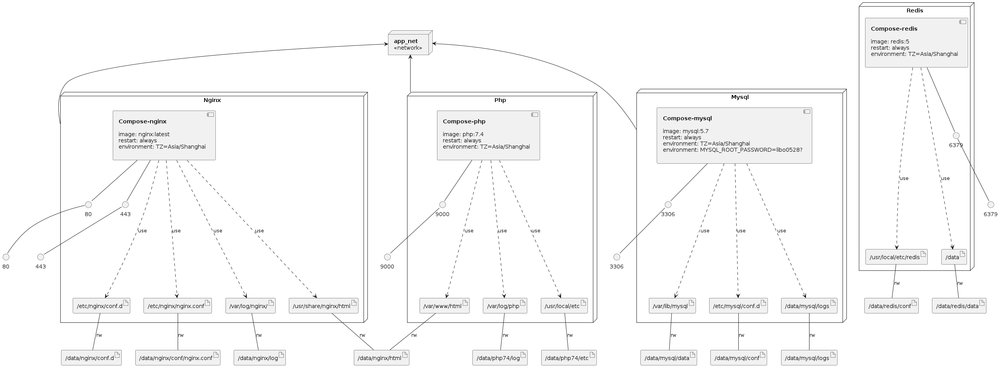

# docker-compose_lnmp

#### 介绍
docker-compose搭建PHP7.4（含扩展）+MySQL5.7+nginx+redis5.1

#### 环境
Linux CentOS7

#### 软件架构
docker-compose搭建LNMP环境映射文件目录，clone到指定data目录，可以一键安装

#### 安装教程

1.  `git clone https://github.com/libo0528/docker-compose-lnmpr.git data`
2.  `cd /data/docker-compose`
3.  `docker-compose build`
4.  `docker-compose up -d`

#### 使用说明

1.  /data/docker-compose/php-extension/dockerfile  是PHP7.4的常用扩展，包括mysqli、gd、mcrypt、zip等等
2.  /data/docker-compose/extension 文件是安装PHP7.4扩展的命令，可以自定义安装 
3.  在/data/docker-compose 目录下执行安装命令

### Infrastructure model

